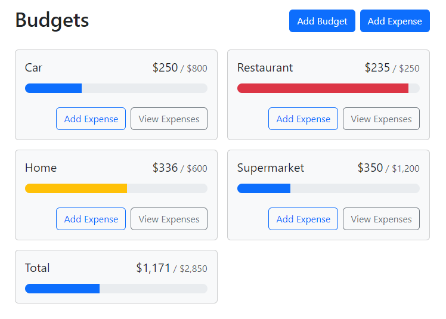
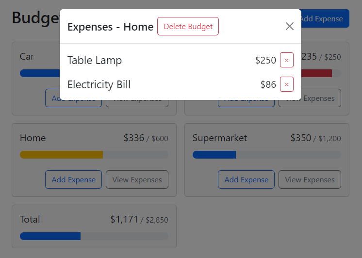
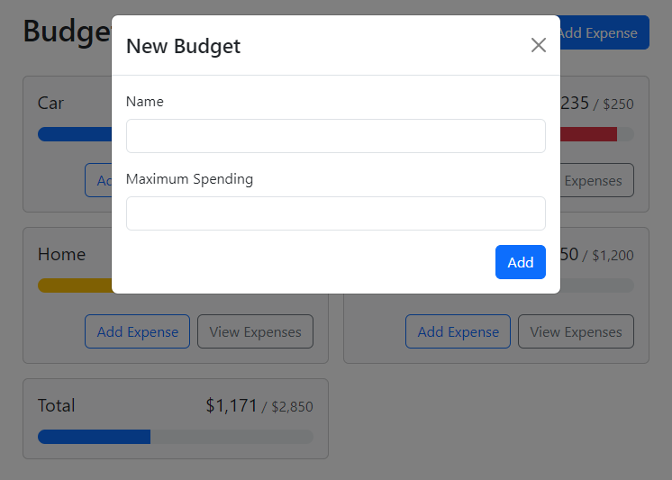
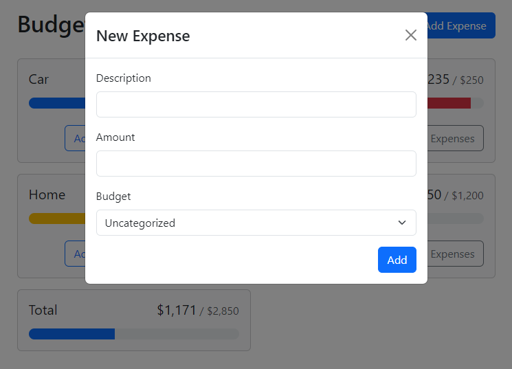

<h1 align="center">Budget Application</h1>

<p align="center">
  <a href="#-tecnologias">Tecnologias</a>&nbsp;&nbsp;&nbsp;|&nbsp;&nbsp;&nbsp;
  <a href="#-projeto">Projeto</a>&nbsp;&nbsp;&nbsp;|&nbsp;&nbsp;&nbsp;
  <a href="#-layout">Layout</a>&nbsp;&nbsp;&nbsp;|&nbsp;&nbsp;&nbsp;
  <a href="#memo-licença">Licença</a>
</p>

<p align="center">
  
</p>

<br>

<!-- <p align="center">
  
</p> -->

## 🚀 Tecnologias


## 💻 Projeto

**Uma aplicação web para controle de orçamento e despesas.** Oferece funcionalidade de cadastro de categorias de despesas para agrupamento. É possível cadastrar e excluir despesas e listar itens já registrados obtendo detalhes de cada categoria com valor máximo e valor total utilizado. Apresenta de maneira fácil e intuitiva, por meio de barras de progresso, os valores já utilizados em cada categoria.

## 🔖 Layout

Para implementação das funcionalidades foram desenvolvidas as seguintes páginas:

### 1. Painel de Orçamento e Despesas
Exibe todos os orçamentos cadastrados e valor total de despesas incluídas. Barras de progresso facilitam a visualização.
<p align="center">
  
</p>

### 2. Consulta de Despesas por Categoria
Utilizado para registrar email e senha escolhida pelo usuário.
<p align="center">
  
</p>

### 3. Cadastro de Orçamento
Formulário para registrar um novo orçamento com inclusão do nome e valor máximo.
<p align="center">
  
</p>

### 4. Cadastro de Despesa
Inclusão de uma nova despesa com descrição, valor e categoria.
<p align="center">
  
</p>

## 🏃 Iniciando o Projeto
Primeiro clone este repositório remoto em sua máquina local:

[git@github.com:denisonkolling/budget-app.git](git@github.com:denisonkolling/budget-app.git)

Lembre-se de adicionar as dependências do projeto:

```bash
npm install
# ou
yarn install
```

Inicie o servidor de desenvolvimento:
```bash
npm run dev
# ou
yarn run dev
```

Acesse [http://localhost:5173/](http://localhost:5173/) com seu navegador para acessar a aplicação.

## 💹 Possíveis Melhorias

Como a aplicação está atualmente em estágio de protótipo funcional podem ser aplicadas diversas melhorias ou criação de novas funcionalidades:
- Login para autenticação de usuário
- Implementação de Backend para persistência das informações em Banco de Dados

## 📝 Licença

Esse projeto está sob a licença MIT.

---